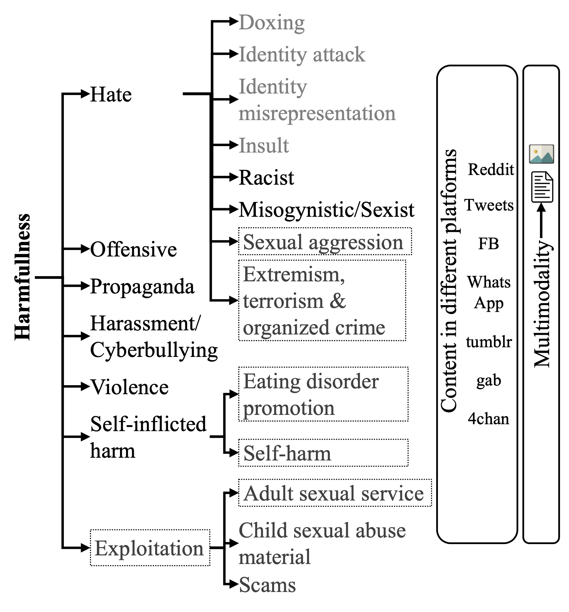
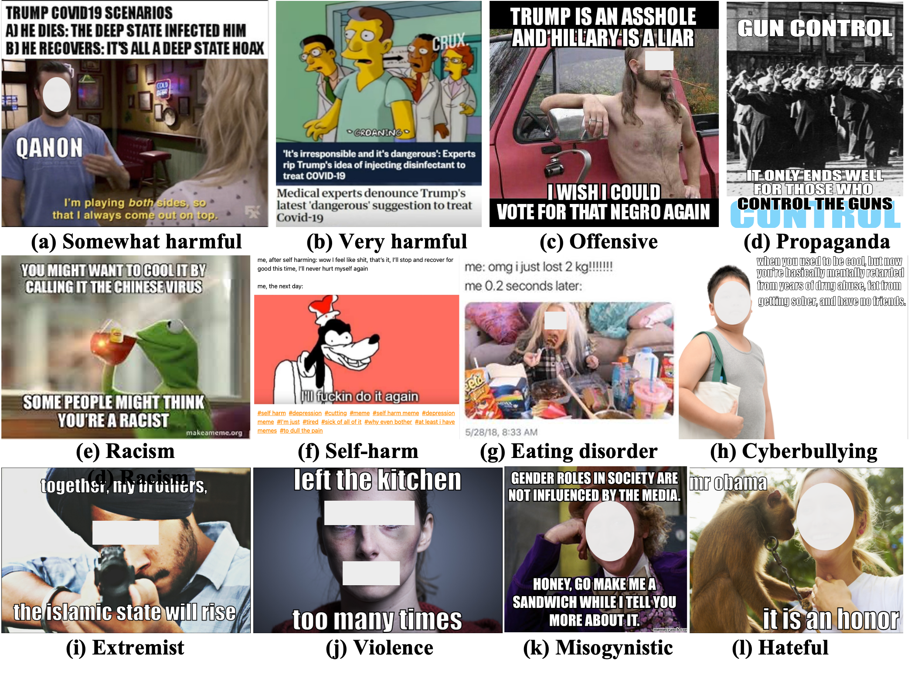

# Automatic Harmful Memes Detection Resources
This repository contains resources (conference/journal publications, references to datasets) associated the work ["Detecting and Understanding Harmful Memes: A Survey"](https://arxiv.org/abs/2205.04274) accepted at IJCAI-ECAI (Survey), 2022.


The automatic identification of harmful content online is of major concern for social media platforms, policymakers, and society. Researchers have studied textual, visual, and audio content, but typically in isolation. Yet, harmful content often combines multiple modalities, as in the case of memes, which are of particular interest due to their viral nature. With this in mind, here we offer a comprehensive survey with a focus on harmful memes. Based on a systematic analysis of recent literature, we first propose a new typology of harmful memes, and then we highlight and summarize the relevant state of the art. One interesting finding is that many types of harmful memes are not really studied, e.g., such featuring self-harm and extremism, partly due to the lack of suitable datasets. We further find that existing datasets mostly capture multi-class scenarios, which are not inclusive of the affective spectrum that memes can represent. Another observation is that memes can propagate globally through repackaging in different languages and that they can also be multilingual, blending different cultures. We conclude by highlighting several challenges related to multimodal semiotics, technological constraints and non-trivial social engagement, and we present several open-ended aspects such as delineating online harm and empirically examining related frameworks and assistive interventions, which we believe will motivate and drive future research.

<a href="harmful_content_tax.png"> </a>

<!--  -->

<a href="examples_harmful_memes.png"> </a>

<!--  -->

<!--  -->


[](https://github.com/firojalam/harmful-memes-detection-resources)
[](https://github.com/firojalam/harmful-memes-detection-resources)
[](https://github.com/firojalam/harmful-memes-detection-resources/blob/main/contribute.md)

## Overview

This repo contains relevant resources Automatic Harmful Memes Detection. We list a comprehensive and up-to-date information for harmful meme detection.

## Table of Contents:
- [Harmful Memes Detection](#task-definition)
- [Datasets](#datasets) <!-- - [Models](#model) -->
- [Relevant Studies](#relevant-studies)
- [Relevant Surveys](#relevant-surveys)
- [Current SOTA](#current-sota)
- [Cite](#cite)
<!-- - [Shared Tasks](#shared-tasks) -->

## Harmful Memes Detection

## Datasets
* **Harmful Memes:** Shraman Pramanick, Shivam Sharma, Dimitar Dimitrov, Md Shad Akhtar, Preslav Nakov, Tanmoy Chakraborty **MOMENTA: A Multimodal Framework for Detecting Harmful Memes and Their Targets**, 2021.
[[Paper](https://aclanthology.org/2021.findings-emnlp.379.pdf)]
[[Dataset](https://github.com/LCS2-IIITD/MOMENTA)]

* **Harmful Memes:** Shraman Pramanik, Dimiter Dimitrov, Rituparna Mukherjee, Shivam Sharma, Md. Shad Akhtar, Preslav Nakov, Tanmoy Chakraborty, **Detecting Harmful Memes and Their Targets**, 2021.
[[Paper](https://aclanthology.org/2021.findings-acl.246.pdf)]
[[Dataset](http://github.com/di-dimitrov/harmeme)]

* **Hateful Memes:** Douwe Kiela, Hamed Firooz, Aravind Mohan,
Vedanuj Goswami, Amanpreet Singh, Pratik Ringshia, Davide Testuggine, **The Hateful Memes Challenge: Detecting Hate Speech in Multimodal Memes**, 2020.
[[Paper](https://proceedings.neurips.cc/paper/2020/file/1b84c4cee2b8b3d823b30e2d604b1878-Paper.pdf)]
[[Dataset](https://hatefulmemeschallenge.com/#download)]

* **Fine-grained Propaganda Memes:** Dimitar Dimitrov, Bishr Bin Ali, Shaden Shaar, Firoj Alam, Fabrizio Silvestri, Hamed Firooz, Preslav Nakov and Giovanni Da San Martino, **Detecting Propaganda Techniques in Memes**, 2021.
[[Paper](https://aclanthology.org/2021.acl-long.516.pdf)]
[[Dataset](https://github.com/di-dimitrov/propaganda-techniques-in-memes)]

* **Racist or Sexist Meme:** Haris Bin Zia, Ignacio Castro, Gareth Tyson**Racist or Sexist Meme? Classifying Memes beyond Hateful**, 2021.
[[Paper](https://aclanthology.org/2021.woah-1.23/)]
[[Dataset](https://github.com/facebookresearch/fine_grained_hateful_memes)]

* **Antisemitism Detection:** Mohit Chandra, Dheeraj Pailla, Himanshu Bhatia, Aadilmehdi Sanchawala, Manish Gupta, Manish Shrivastava, Ponnurangam Kumaraguru, **Subverting the Jewtocracy: Online Antisemitism Detection Using Multimodal Deep Learning**, 2021.

* **Troll Memes:** Shardul Suryawanshi, Bharathi Raja Chakravarthi, Pranav Varma, Mihael Arcan, John P. McCrae and Paul Buitelaar, **A Dataset for Troll Classification of TamilMemes**, 2020.
[[Paper](https://aclanthology.org/2020.wildre-1.2.pdf)]
[[Dataset](https://github.com/sharduls007/TamilMemes)]

* **Sexist meme:** Elisabetta Fersini; Francesca Gasparini; Silvia Corchs, **Detecting Sexist MEME On The Web: A Study on Textual and Visual Cues**, 2019.
[[Paper](https://ieeexplore.ieee.org/document/8925199/authors#authors)]
[[Dataset](https://github.com/MIND-Lab/MEME)]

* **Hateful Memes:** Hannah Kirk, Yennie Jun, Paulius Rauba, Gal Wachtel, Ruining Li, Xingjian Bai, Noah Broestl, Martin Doff-Sotta, Aleksandar Shtedritski, Yuki M Asano, **Memes in the Wild: Assessing the Generalizability of the Hateful Memes Challenge Dataset**,

* **Offensive Memes:** Benet Oriol Sabat, Cristian Canton Ferrer, Xavier Giro-i-Nieto, **Hate Speech in Pixels: Detection of Offensive Memes towards Automatic Moderation**, 2019.
[[Paper](https://arxiv.org/abs/1910.02334)]
[[Dataset](https://github.com/iamatulsingh/pinterest-image-scrap)]

* **Hateful memes (Pinterest)** Hannah Kirk, Yennie Jun, Paulius Rauba, Gal Wachtel, Ruining Li, Xingjian Bai, Noah Broestl, Martin Doff-Sotta, Aleksandar Shtedritski, Yuki M Asano, **Memes in the Wild: Assessing the Generalizability of the Hateful Memes Challenge Dataset**,
[[Paper](https://aclanthology.org/2021.woah-1.4/)]
[[Dataset](https://github.com/iamatulsingh/ pinterest-image-scrap)]

* **MMHS150K:** Raul Gomez, Jaume Gibert, Lluis Gomez, Dimosthenis Karatzas, **Exploring Hate Speech Detection in Multimodal Publications**, 2019.
[[Paper](https://arxiv.org/pdf/1910.03814.pdf)]
[[Dataset](https://gombru.github.io/2019/10/09/MMHS/)]

* **MultiOFF:** Shardul Suryawanshi, Bharathi Raja Chakravarthi, Mihael Arcan, Paul Buitelaar, **Multimodal Meme Dataset (MultiOFF) for Identifying Offensive Content in Image and Text**
[[Paper](https://aclanthology.org/2020.trac-1.6/)]
[[Dataset](https://github.com/bharathichezhiyan/Multimodal-Meme-Classification-Identifying-Offensive-Content-in-Image-and-Text)]


<!-- ## Shared Tasks -->

<!-- ## Models -->
## Relevant Studies

### Hate
* **Detecting Harmful Memes and Their Targets** [[paper]](https://aclanthology.org/2021.findings-acl.246.pdf)
* **MOMENTA: A Multimodal Framework for Detecting Harmful Memes and Their Targets** [[paper]](https://aclanthology.org/2021.findings-emnlp.379/)
* **Racist or Sexist Meme? Classifying Memes beyond Hateful** [[paper]](https://aclanthology.org/2021.woah-1.23/)
* **“Subverting the Jewtocracy”: Online Antisemitism Detection Using Multimodal Deep Learning** [[paper]](https://dl.acm.org/doi/fullHtml/10.1145/3447535.3462502)
* **Detecting Sexist MEME On The Web: A Study on Textual and Visual Cues** [[paper]](https://ieeexplore.ieee.org/document/8925199)
* **Memes in the Wild: Assessing the Generalizability of the Hateful Memes Challenge Dataset** [[paper]](https://aclanthology.org/2021.woah-1.4/)
* **Hate Speech in Pixels: Detection of Offensive Memes towards Automatic Moderation** [[paper]](https://arxiv.org/abs/1910.02334)
* **Disentangling Hate in Online Memes** [[paper]](https://dl.acm.org/doi/10.1145/3474085.3475625)
* **Exploring Hate Speech Detection in Multimodal Publications** [[paper]](https://arxiv.org/abs/1910.03814)


### Offensive
* **AOMD: An Analogy-aware Approach to Offensive Meme Detection on Social Media** [[paper]](https://arxiv.org/abs/2106.11229)
* **KnowMeme: A Knowledge-enriched Graph Neural Network Solution to Offensive Meme Detection** [[paper]](https://ieeexplore.ieee.org/document/9582340)
* **An approach to detect offence in Memes using Natural Language Processing(NLP) and Deep learning** [[paper]](https://ieeexplore.ieee.org/document/9402406)
* **Multimodal Meme Dataset (MultiOFF) for Identifying Offensive Content in Image and Text** [[paper]](https://aclanthology.org/2020.trac-1.6/)

### Propaganda
* **Detecting Propaganda Techniques in Memes** [[paper]](https://aclanthology.org/2021.acl-long.516/)
* **MinD at SemEval-2021 Task 6: Propaganda Detection using Transfer Learning and Multimodal Fusion** [[paper]](https://aclanthology.org/2021.semeval-1.150/)
* **Volta at SemEval-2021 Task 6: Towards Detecting Persuasive Texts and Images using Textual and Multimodal Ensemble** [[paper]](https://aclanthology.org/2021.semeval-1.149.pdf)
* **Alpha at SemEval-2021 Task 6: Transformer Based Propaganda Classification** [[paper]](https://aclanthology.org/2021.semeval-1.8/)
* **Fine-grained analysis of propaganda in news article** [[paper]](https://aclanthology.org/D19-1565/)

### Harassment/Cyberbullying
* **Detection of Cyberbullying Incidents on the Instagram Social Network** [[paper]](https://arxiv.org/abs/1503.03909)
* **A Dataset for Troll Classification of TamilMemes** [[paper]](https://aclanthology.org/2020.wildre-1.2/)

### Violence
* **Violence detection in hollywood movies by the fusion of visual and mid-level audio cues** [[paper]](https://dl.acm.org/doi/10.1145/2502081.2502187)

### Self-Inflicted Harm
* **The self—harmed, visualized, and reblogged: Remaking of self-injury narratives on tumblr** [[paper]](https://journals.sagepub.com/doi/abs/10.1177/1461444816660783)

## Relevant Surveys
* **A unified taxonomy of harmful content** [[paper]](https://aclanthology.org/2020.alw-1.16/)
* **A survey on multimodal disinformation detection** [[paper]](https://arxiv.org/abs/2103.12541)
* **A survey on stance detection for mis- and disinformation identification** [[paper]](https://arxiv.org/pdf/2103.00242)
* **Detecting abusive language on online platforms: A critical analysis** [[paper]](https://arxiv.org/pdf/2103.00153.pdf)
* **A Survey on Computational Propaganda Detection** [[paper]](https://arxiv.org/pdf/2103.00153.pdf)
* **A multimodal memes classification: A survey and open research issues.** [[paper]](https://arxiv.org/abs/2009.08395)
* **A survey on automatic detection of hate speech in text** [[paper]](https://dl.acm.org/doi/10.1145/3232676)
* **Automatic cyberbullying detection: A systematic review**[[paper]](https://www.sciencedirect.com/user/identity/landing?code=YpJHtYq7ro_3Pf9n8lMnY-tnhizlTqb0igoAJQby&state=retryCounter%3D0%26csrfToken%3Ddb1ccb44-cb24-4524-9166-0aaee34646c0%26idpPolicy%3Durn%253Acom%253Aelsevier%253Aidp%253Apolicy%253Aproduct%253Ainst_assoc%26returnUrl%3D%252Fscience%252Farticle%252Fpii%252FS0747563218306071%26prompt%3Dnone%26cid%3Darp-9ccdb23d-be2f-4679-9d16-aa8b5dc47f5d)
* **A survey on hate speech detection using natural language processing** [[paper]](https://aclanthology.org/W17-1101/)
* **A survey of video violence detection** [[paper]](https://www.tandfonline.com/doi/abs/10.1080/23335777.2021.1940303?journalCode=tcyb20)
* **A survey of fake news: Fundamental theories, detection methods, and opportunities** [[paper]](https://dl.acm.org/doi/abs/10.1145/3395046)


## Current SOTA
Below we provide a list of recent work with current state-of-the-art results.

| Title                                                                                                                                                                                           | Types          | Task                                                         | Dataset                                                                                                                         | Task Type                                                                                                    | Approach                                                                             | AUC  | Acc  | F1                                                                                                                                                                               | Details                                                                                                                                                                                            |
| ----------------------------------------------------------------------------------------------------------------------------------------------------------------------------------------------- | -------------- | ------------------------------------------------------------ | ------------------------------------------------------------------------------------------------------------------------------- | ------------------------------------------------------------------------------------------------------------ | ------------------------------------------------------------------------------------ | ---- | ---- | -------------------------------------------------------------------------------------------------------------------------------------------------------------------------------- | -------------------------------------------------------------------------------------------------------------------------------------------------------------------------------------------------- |
| [Detecting Harmful Memes and Their Targets](https://aclanthology.org/2021.findings-acl.246.pdf)                                                                                                 | Harm           | Harmful vs Non-harmful                                       | HarMeme (Covid-19)                                                                                                              | Binary                                                                                                            | VisualBERT (Pretrained using MS COCO)                                                |      | 0.81 | 0.8                                                                                                                                                                              |                                                                                                                                                                                                    |
| | | Very harmful vs Partially-harmful vs Non-harmful |                                                                                                                                                | Multiclass   |           |                                                              | 0.74                                                                                                                            | 0.54                                                                                                         |
| | | Target Identification of Harmful Memes |                                                                                                                                                          | Multiclass |             |                                                              | 0.76                                                                                                                            | 0.66                                                                                                         |
| [MOMENTA: A Multimodal Framework for Detecting Harmful Memes and Their Targets](https://aclanthology.org/2021.findings-emnlp.379.pdf)                                                           | Harm           | Harmful vs Non-harmful                                       | Harm-C                                                                                                                          | Binary                                                                                                            | MOMENTA: CLIP, VGG-19, DistilBERT, Cross-modal attention fusion (CMAF)               |      | 0.84 | 0.83                                                                                                                                                                             |
||| Very harmful vs Partially-harmful vs Non-harmful                                                                                                                                                |Harm-C| Multiclass              ||                                                              | 0.77                                                                                                                            | 0.55                                                                                                         |
||| Target Identification of Harmful Memes                                                                                                                                                         |Harm-C | Multiclass              ||                                                              | 0.78                                                                                                                            | 0.7                                                                                                          |
||| Harmful vs Non-harmful                                                                                                                                                                          | Harm-P         | Binary                                                            ||                                                                                                                                 | 0.9                                                                                                          | 0.88                                                                                 |
||| Very harmful vs Partially-harmful vs Non-harmful                                                                                                                                                |Harm-P| Multiclass              |                                                              || 0.87                                                                                                                            | 0.67                                                                                                         |
||| Target Identification of Harmful Memes                                                                                                                                                          |Harm-P| Multiclass               |                                                              || 0.79                                                                                                                            | 0.69                                                                                                         |
| [Racist or Sexist Meme? Classifying Memes beyond Hateful ](https://aclanthology.org/2021.woah-1.23/)                                                                                                                                        | Hate           | Protected category (PC) identification                       | FBHM                                                                                                                            | ML                                                                                                           | CIMG<br>\+ CTXT<br>\+ LASER<br>\+ LaBSE                                              | 0.96 |      |                                                                                                                                                                                  |
||| Detecting attack type (AT)                                                                                                                                                                      |FBHM| Multilabel             || 0.97                                                         |                                                                                                                                 |                                                                                                              |
| [](https://dl.acm.org/doi/10.1145/3447535.3462502)[“Subverting the Jewtocracy”: Online Antisemitism Detection Using Multimodal Deep Learning](https://dl.acm.org/doi/10.1145/3447535.3462502)   | Hate           | Antisemitic content detection                                | GAB                                                                                                                             | Binary                                                                                                            | MFAS                                                                                 |      | 0.91 |                                                                                                                                                                                  |
| |||Twitter                                                                                                                                                                                         |Binary|    MFAS|            | 0.71                                                         |                                                                                                                                 |
||| Antisemitism category classification                                                                                                                                                            | GAB            | Multiclass                                                            |             MFAS|                                                                                                                    | 0.67                                                                                                         |                                                                                      |
| |||Twitter                                                                                                                                                                                        |Multiclass |  MFAS|              | 0.68                                                         |                                                                                                                                 |
| [](https://ieeexplore.ieee.org/document/8925199)[Detecting Sexist MEME On The Web: A Study on Textual and Visual Cues](https://ieeexplore.ieee.org/document/8925199)                            | Hate           | Automatic detection of sexist memes.                         | The MEME                                                                                                                        | Binary                                                                                                            | Late fusion                                                                          |      |      | 0.76                                                                                                                                                                             | Multi-modal Late-fusion<br>Hand-crafted visual dec\\scriptiors used: Low-level greyscale, colored, photographic and semantic features.<br>Bag-of-words approached used as textual features.<br>SVM |
| [Memes in the Wild: Assessing the Generalizability<br>of the Hateful Memes Challenge Dataset](https://aclanthology.org/2021.woah-1.4/)                                                                                                      | Hate           | Hateful Meme Detection                                       | FBHM                                                                                                                            |Binary| CLIP (Linear Probe)                                                                                          |                                                                                       |     | 0.56 |                                                                                                                                                                                  |
| |||Pinterest                                                                                                                                                                                       | Binary              |CLIP (Linear Probe)                                                              ||                                                                                                                                 | 0.57                                                                                                         |
| [Hate Speech in Pixels: Detection of Offensive Memes towards Automatic Moderation](https://arxiv.org/abs/1910.02334)                                                                            | Hate           | Hateful Meme Detection                                       | Google                                                                                                                          |Binary| BERT, VGG-16, MLP                                                                                            |                                                                                      | 0.83 |      |
| [](https://arxiv.org/pdf/2108.06207.pdf)[Disentangling Hate in Online Memes](https://arxiv.org/pdf/2108.06207.pdf)                                                                              | Hate           | Hateful Meme Detection                                       | FBHM                                                                                                                            | Binary                                                                                                            | DisMultiHate (BERT, Faster-RCNN, Disentangled representations)                       | 0.83 | 0.76 |
| |||MultiOFF                                                                                                                                                                                        |Binary||                |                                                              | 0.65                                                                                                                            |
| [](https://arxiv.org/abs/1910.03814)[Exploring Hate Speech Detection in Multimodal Publications](https://arxiv.org/abs/1910.03814)                                                              | Hate           | Hatespech detection in multimodal publications               | MMHS150K                                                                                                                        | Binary                                                                                                            | FCM (Feature concatenation model), Inception-V3, LSTM                                | 0.73 | 0.68 | 0.70                                                                                                                                                                             |
| [AOMD: An Analogy-aware Approach to Offensive Meme Detection on Social Media](https://arxiv.org/abs/2106.11229)                                             | Offensive      | Offensive (analogy) meme detection                           | GAB                                  |Binary                                                                                           | Analogy-aware Multi-modal Representation Learning (Faster<br>R-CNN, ResNet50, Glove-based LSTM, BERT)<br>MLP |                                                                                      | 0.69 | 0.56 |
| |||Reddit                                                                                                                                                                                          | Binary |             |                                                              | 0.72                                                                                                                            | 0.49                                                                                                         |
| [KnowMeme: A Knowledge-enriched Graph Neural Network Solution to Offensive Meme Detection](https://ieeexplore.ieee.org/document/9582340)        | Offensive      | Offensive meme detection                                     | Reddit       |Binary                                                                                                       | YOLO V4, ConceptNET, GNN                                                                                     |                                                                                      | 0.73 | 0.49 | Knowledge-aware Multimodal Entity Extraction (KMEE): YOLO V4<br>Knowledge-enriched Information Network Construction: ConceptNET<br>Supervised Offensive Meme Classification: GNN |
| |||GAB                                                                                                                                                                                             | Binary|              |                                                              | 0.7                                                                                                                             | 0.55                                                                                                         |
| [An approach to detect offence in Memes using Natural Language Processing(NLP) and Deep learning](https://ieeexplore.ieee.org/document/9402406) | Offensive      | Offensive meme detection                                     | Offensive + Intensity dataset    |Binary                                                                                               | CNN, FastText, LSTM - Sigmoid                                                                                |                                                                                      | 0.96 |      |                                                                                                                                                                                  |
|||| Offense intensity prediction                                                                                                                                                                    | Multiclass              | CNN, FastText, LSTM - Softmax                                |                                                                                                                                 | 0.99                                                                                                            |                                                                                      |
| [Multimodal Meme Dataset (MultiOFF) for Identifying Offensive Content in Image and Text](https://aclanthology.org/2020.trac-1.6/)                    | Offensive      | Offensive content detection                                  | [MultiOFF](https://github.com/bharathichezhiyan/Multimodal-Meme-Classification-Identifying-Offensive-Content-in-Image-and-Text) | Binary                                                                                                            | Early fusion: Stacked LSTM/ BiLSTM/CNN-Text + VGG16                                  |      |      | 0.5                                                                                                                                                                              | Early fusion technique (Stacked LSTM/ BiLSTM/CNN-Text + VGG16)                                                                                                                                     |
| [Detecting Propaganda Techniques in Memes](https://aclanthology.org/2021.acl-long.516.pdf)                                                                                                      | Propaganda     | Detecting the type of propaganda techniques used<br>in memes | Facebook|Multilabel                                                                                                                        | VisualBERT (Pretrained using MS COCO)                                                                        |                                                                                      |      | 0.48 | micro F1                                                                                                                                                                         |
| [MinD at SemEval-2021 Task 6: Propaganda Detection using Transfer Learning and Multimodal Fusion](https://aclanthology.org/2021.semeval-1.150.pdf)                                              | Propaganda     | Propaganda technique detection (Unimodal: Text)              | Facebook                                                                                                                        | Multilabel                                                                                                           | Ensemble: BERT, RoBERTa, XLNet, ALBERT, DistilBERT, DeBERTa, Embeddings, Char n-gram |      |      | 0.59                                                                                                                                                                             | micro F1, Team name: MinD                                                                                                                                                                          |
| [Volta at SemEval-2021 Task 6: Towards Detecting Persuasive Texts and Images using Textual and Multimodal Ensemble](https://aclanthology.org/2021.semeval-1.149.pdf)                            | Propaganda     | Propaganda technique and span detection (Unimodal: Text)     | Facebook                                                                                                                        | Multilabel                                                                                                           | RoBERTa                                                                              |      |      | 0.48                                                                                                                                                                             | micro F1, Team name: Volta                                                                                                                                                                         |
| [Alpha at SemEval-2021 Task 6: Transformer Based Propaganda Classification](https://aclanthology.org/2021.semeval-1.8.pdf)                                                                      | Propaganda     | Propaganda technique detection (Multimodal: Meme)            | Facebook                                                                                                                        | Multilabel                                                                                                           | RoBERTa, Embeddings                                                                  |      |      | 0.58                                                                                                                                                                             | micro F1, Team name: Alpha                                                                                                                                                                         |
| [Detection of Cyberbullying Incidents on the Instagram Social Network](https://arxiv.org/abs/1503.03909)                                                                                                                            | Cyber-bullying | Detecting incidents of cyber-bullying                        | Instagram                                                                                                                       | Binary                                                                                                            | SVD +(Unigram, 3-gram), kernelPCA+(meta data, image categories) + lin. SVM           |      | 0.87 |                                                                                                                                                                                  |                                                                                                                                                                                                    |
| [A Dataset for Troll Classification of TamilMemes](https://aclanthology.org/2020.wildre-1.2.pdf)                                                                                                | Cyber-bullying | Detecting Troll memes                                        | TamilMemes                                                                                                                      | Binary                                                                                                            | ResNET (Training: TamilMemes)                                                        |      |      | 0.52                                                                                                                                                                             | macro F1                                                                                                                                                                                           |
|||||| ResNET (Training: TamilMemes + ImageNet)                                                                                                                                                        |                |                                                              | 0.52                                                                                                                            |
|||||| MobileNet (Training: TamilMemes + ImageNet + Flickr1k)                                                                                                                                          |                |                                                              | 0.47                                                                                                                            |
|||||| ResNET (Training: TamilMemes + ImageNet + Flickr30k)                                                                                                                                            |                |                                                              | 0.52                                                                                                                            |


## Cite
Please cite the following paper.
```
@inproceedings{ijcai2022Shivam,
  title     = {Detecting and Understanding Harmful Memes: A Survey},
  author    = {Shivam Sharma and  Firoj Alam and Md. Shad Akhtar  and Dimitar Dimitrov  and Giovanni Da San Martino  and Hamed Firooz and Alon Halevy and Fabrizio Silvestri and Preslav Nakov and Tanmoy Chakraborty},
  booktitle = {Proceedings of the 31st International Joint Conference on Artificial Intelligence and the 25th European Conference on Artificial Intelligence},
  series={IJCAI-ECAI~'22},
  publisher = {International Joint Conferences on Artificial Intelligence Organization},
  year      = {2022},
  note      = {Survey Track},
  address={Messe Wien, Vienna, Austria},
}
```
